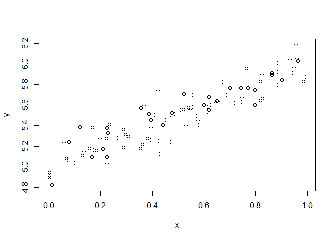

AIC
================
2024-09-12

## AIC

We have F-test to compare nested models. AIC can be used to compare
non-neseted models as long as they all have the same response variable.

Let’s generate a dataset:

``` r
set.seed(2020)
x <- runif(100)
y <- 5+x+rnorm(100,0,.1)
plot(x,y)
```

<!-- -->

Let’s fit the models:

$$
\begin{aligned}
\text{M1: } \mathbb{E}(Y|X)&=\beta_0+\beta_1X \\
\text{M2: } \mathbb{E}(Y|X)&=\beta_0+\beta_1log(X) \\
\text{M3: } \mathbb{E}(log(Y)|X)&=\beta_0+\beta_1X
\end{aligned}
$$

Then look at their AICs:

``` r
m1 <- lm(y~x)
m2 <- lm(y~log(x))
m3 <- lm(log(y)~x)
lapply(list(m1,m2,m3), AIC)
```

    ## [[1]]
    ## [1] -138.8774
    ## 
    ## [[2]]
    ## [1] -38.34254
    ## 
    ## [[3]]
    ## [1] -477.5991

Let’s plot the model to see which is better

``` r
plot(x,y)
lines(x,coef(m1)[1]+coef(m1)[2]*x,col="goldenrod",lwd=2)
curve(coef(m2)[1]+coef(m2)[2]*log(x),col="navyblue",add=T,lwd=2)
curve(exp(coef(m3)[1]+coef(m3)[2]*x),col = "violetred3",add=T,lwd=2)
legend(.02,6.2,legend = c("m1","m2","m3"),col=c("goldenrod","navyblue","violetred3"),cex=.6)
```

<!-- -->

Model 2 is the worst clearly. Model 1 and 3 looks close. AIC told us
that model 1 is better than model 2 while model 3 is the best. However,
we cannot compare AIC of model 3 with others since the output variables
$Y$ and $log(Y)$ from model 1 and 3 respectively are not the same.

When fitting model, `R` removes `NA` from the dataset automatically. So,
we have to be careful when modeling a dataset with missing values since
model $y=a+bx_1$ and model $y=a+bx_2$ may be fitted on different data.
