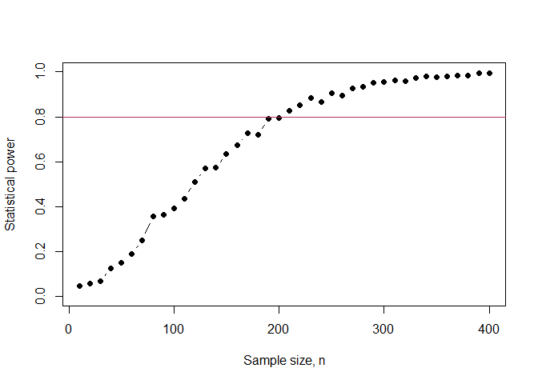

Minimum sample size of a model
================

## Assessment

For the eucalyptus data, species E. cloeziana (encoded clo) consider the
relationship between tree height and the dbh. Let the first 10
observations in the data file represent a pilot study.

``` r
df <- read.csv("datasets/eucalyptus.csv")
df[df$spp == "clo",] -> pilot
pilot[1:10,] -> pilot
```

What is the minimum sample size ($n$) of the sample you would need to
collect to ensure that you detect the relationship observed in the pilot
data file with the probability (statistical power) of at least 80% at
the statistical significance level of 1%?

``` r
nval = seq(10,400,10)
pow <- 0
for(i in 1:length(nval)){
  beta <- numeric(1000)
  for(j in 1:1000){
    bst <- sample(10,nval[i],replace = T)
    m <- lm(hgt ~ dbh, data = pilot[bst,])
    beta[j] = (summary(m)$coefficients[2,4]<.01)
  }
  pow[i] = mean(beta)
}

d.pow <- data.frame(n = nval,
                    p = pow)

plot(d.pow$n,d.pow$p,ty="b",pch = 16,
     xlab = "Sample size, n",
     ylab = "Statistical power",
     ylim = c(0,1))
abline(h=.8, col = "maroon")
```

<!-- -->

``` r
d.pow[d.pow$p > .8,][1,]
```

    ##      n     p
    ## 21 210 0.826
