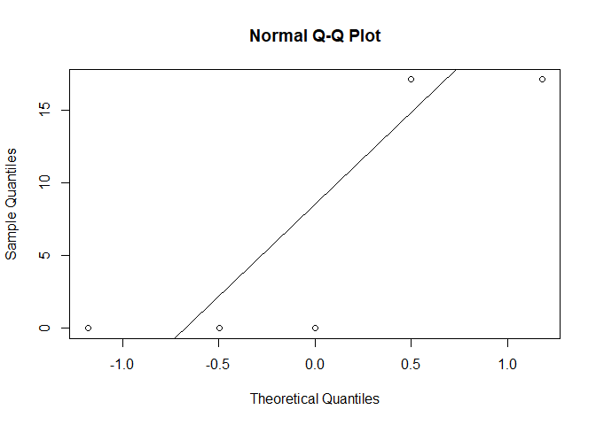

Mixed effects generalised linear model
================
2024-09-30

Random effects in generalised linear model are sumply added to a link
function:

$$
\text{logit}(p_i) = a + bX_i + \xi_{PID_i}
$$

where $X_i$ is 0 or 1 depending on whether the measurement was taken
before or after the treatment.

Even this is a binomial GLM, we still assumes that the $\xi$ have a
normal distribution:

$$
\xi \sim N(0,\sigma_\xi^2)
$$

We can use `qqnorm` in order to check whether the actual $\xi$ is
normally distributed.

Let’s try to fit a mixed effect glm.

``` r
library(lme4)
library(lmerTest)

d <- data.frame(id = rep(1:5,2),x = rep(0:1,each = 5),
                y = c(0,1,1,0,0,0,1,1,0,0))
```

``` r
m <- glmer(y ~ x + (1|id), data = d,
           family = "binomial"(link = "logit"))
summary(m)
```

    ## Generalized linear mixed model fit by maximum likelihood (Laplace
    ##   Approximation) [glmerMod]
    ##  Family: binomial  ( logit )
    ## Formula: y ~ x + (1 | id)
    ##    Data: d
    ## 
    ##      AIC      BIC   logLik deviance df.resid 
    ##     12.2     13.1     -3.1      6.2        7 
    ## 
    ## Scaled residuals: 
    ##       Min        1Q    Median        3Q       Max 
    ## -0.003183 -0.003183 -0.003183  0.059820  0.059820 
    ## 
    ## Random effects:
    ##  Groups Name        Variance Std.Dev.
    ##  id     (Intercept) 2396     48.94   
    ## Number of obs: 10, groups:  id, 5
    ## 
    ## Fixed effects:
    ##               Estimate Std. Error z value Pr(>|z|)
    ## (Intercept) -1.145e+01  7.280e+00  -1.573    0.116
    ## x            5.511e-08  5.646e+00   0.000    1.000
    ## 
    ## Correlation of Fixed Effects:
    ##   (Intr)
    ## x -0.388

The output is similar to normal `lmer()`

Now, let’s plot random effects

``` r
qqnorm(c(unlist(ranef(m)$id)))
qqline(c(unlist(ranef(m)$id)))
```

<!-- -->

Checking distribution of a model with 5 observations tells us nothing.
However, we know what to write in order to attain the information.

In GLM, whatever our family and link function are, random effects are
added to the link function. Everything that applies to glms applies to
mixed effects glm as well. This is the model that quite likely to use in
real life practice.
