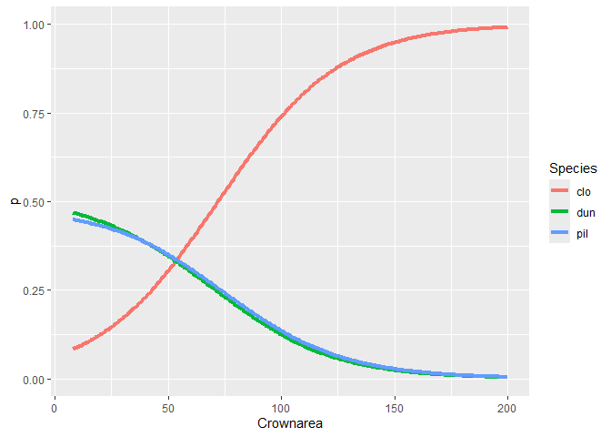

Multinomial logit assessment
================
2024-10-01

## Assessment: Nominal categorical GLM

Repeat the analysis in this section (first, perform the 1-way ANOVA,
then fit a multinomial logistic model) using the variable `crownarea`
rather than the `hgt`.

``` r
library(tidyverse)
library(nnet)

d <- read.csv(file = "datasets/eucalyptus.csv")
anova(lm(crownarea ~ spp, data = d))
```

    ## Analysis of Variance Table
    ## 
    ## Response: crownarea
    ##            Df Sum Sq Mean Sq F value    Pr(>F)    
    ## spp         2 167093   83546  108.41 < 2.2e-16 ***
    ## Residuals 717 552561     771                      
    ## ---
    ## Signif. codes:  0 '***' 0.001 '**' 0.01 '*' 0.05 '.' 0.1 ' ' 1

``` r
m <- multinom(spp ~ crownarea, data = d)
```

    ## # weights:  9 (4 variable)
    ## initial  value 791.000848 
    ## final  value 704.216953 
    ## converged

``` r
summary(m)
```

    ## Call:
    ## multinom(formula = spp ~ crownarea, data = d)
    ## 
    ## Coefficients:
    ##     (Intercept)   crownarea
    ## dun    2.042661 -0.03822417
    ## pil    1.986482 -0.03683971
    ## 
    ## Std. Errors:
    ##     (Intercept)   crownarea
    ## dun   0.2253799 0.004038528
    ## pil   0.2238247 0.003957866
    ## 
    ## Residual Deviance: 1408.434 
    ## AIC: 1416.434

To test the coefficients, we model without the coefficient and compare
both models with anova

``` r
m0 <- multinom(spp ~ 1, data = d)
```

    ## # weights:  6 (2 variable)
    ## initial  value 791.000848 
    ## final  value 791.000848 
    ## converged

``` r
anova(m0,m)
```

    ##       Model Resid. df Resid. Dev   Test    Df LR stat. Pr(Chi)
    ## 1         1      1438   1582.002           NA       NA      NA
    ## 2 crownarea      1436   1408.434 1 vs 2     2 173.5678       0

``` r
lapply(list("no coef" = m0, coef = m), AIC)
```

    ## $`no coef`
    ## [1] 1586.002
    ## 
    ## $coef
    ## [1] 1416.434

It appears that there is a statistically significant difference between
the two models. The crownarea of the tree does affect the probability of
belonging to a particular species.

## Plots

Let’s plot the result of multinomial:

``` r
d.pred <- data.frame(crownarea = seq(8,200,1))

matrix.prob <- predict(m,d.pred, type ="probs")

d2 <- expand.grid(crownarea = seq(8,200,1),
                  Species = c("clo","dun","pil"))

d2$p <- c(matrix.prob)

d2 %>%
  ggplot(aes(x = crownarea, y = p, group = Species))+
  geom_line(aes(col = Species),linewidth = 1.5)+
  xlab("Crownarea")+
  ylim(c(0,1))
```

<!-- -->

Based on the graph, trees should be `dun` when the crownarea is more
than around 50, `pil` when the crownarea is between 8 - 50, and `clo`
otherwise.

## Goodness of fit

We can check the goodness of fit of the model with apparent error ratio
(AER). Let’s start by recording the predicted values and creating the
*confusionn matrix*.

``` r
pred <- predict(m)
table(d$spp,pred)
```

    ##      pred
    ##       clo dun pil
    ##   clo 150  60  30
    ##   dun  45 149  46
    ##   pil  52 154  34

The confusion matrix is a contingency table of observed vs. predicted
data. The diagonal is the correctly predicted cases. Others are errors.
So, we can get AER by $AER = \frac{error}{total}$.

``` r
scales::percent(mean(pred != d$spp),.01)
```

    ## [1] "53.75%"

## Alternative models

Now try using a transformation of the crownarea, such as $\log()$ or a
square root.

Try a model with both, crownarea and hgt, and their interaction.

Is your AER for that model better than for the crownarea-only one?

``` r
m.int <- multinom(spp ~ crownarea*hgt, data = d)
```

    ## # weights:  15 (8 variable)
    ## initial  value 791.000848 
    ## iter  10 value 657.215994
    ## final  value 647.459938 
    ## converged

``` r
m.add <- multinom(spp ~ crownarea+hgt, data = d)
```

    ## # weights:  12 (6 variable)
    ## initial  value 791.000848 
    ## iter  10 value 648.885358
    ## final  value 648.883797 
    ## converged

``` r
m.log <- update(m,.~log(.))
```

    ## # weights:  9 (4 variable)
    ## initial  value 791.000848 
    ## final  value 705.713355 
    ## converged

``` r
m.sqrt <- update(m,.~sqrt(.))
```

    ## # weights:  9 (4 variable)
    ## initial  value 791.000848 
    ## final  value 704.074865 
    ## converged

``` r
aer <- function(m, df) {
  pred <- predict(m)
  table(df$spp, pred)
  result <- mean(pred != df$spp)
  return(result)
}

lapply(list(base = m,
            log = m.log,
            sqrt = m.sqrt,
            add = m.add,
            int = m.int), aer,d)
```

    ## $base
    ## [1] 0.5375
    ## 
    ## $log
    ## [1] 0.5180556
    ## 
    ## $sqrt
    ## [1] 0.5291667
    ## 
    ## $add
    ## [1] 0.4416667
    ## 
    ## $int
    ## [1] 0.4458333
