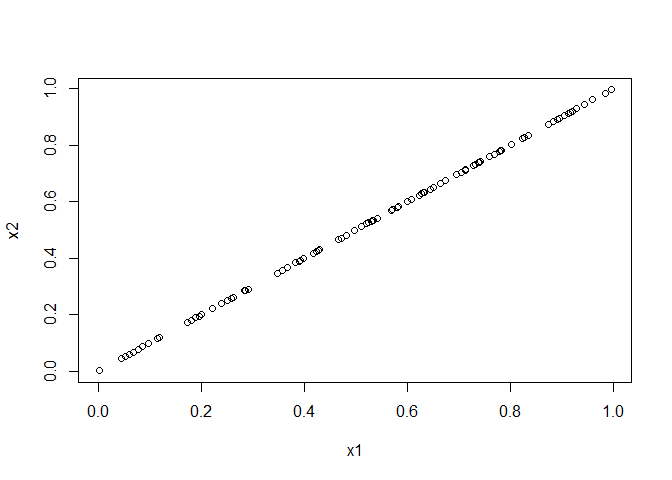

Multicollinearity
================
2024-09-11

## Meaning

Multicollinearity means input variables are highly correlated.

Let’s simulate an example.

## Two perfectly linearly correlated inputs

Generate a data set with two input variables $X_1$ and $X_2$ such that
$X_1=X_2$, and an output variable $Y=X_1+X_2+\varepsilon$ where
$\varepsilon \sim N(0,1)$.

``` r
set.seed(20202020)
x1 <- runif(100)
x2 <- x1
y <- x1+x2+rnorm(100)
```

Then fit the linear model:

``` r
m <- lm(y~x1+x2)
summary(m)
```

    ## 
    ## Call:
    ## lm(formula = y ~ x1 + x2)
    ## 
    ## Residuals:
    ##      Min       1Q   Median       3Q      Max 
    ## -2.13088 -0.61474  0.06228  0.64894  1.61865 
    ## 
    ## Coefficients: (1 not defined because of singularities)
    ##             Estimate Std. Error t value Pr(>|t|)    
    ## (Intercept)   0.1377     0.1962   0.702    0.485    
    ## x1            1.7346     0.3216   5.394 4.79e-07 ***
    ## x2                NA         NA      NA       NA    
    ## ---
    ## Signif. codes:  0 '***' 0.001 '**' 0.01 '*' 0.05 '.' 0.1 ' ' 1
    ## 
    ## Residual standard error: 0.8677 on 98 degrees of freedom
    ## Multiple R-squared:  0.2289, Adjusted R-squared:  0.221 
    ## F-statistic: 29.09 on 1 and 98 DF,  p-value: 4.79e-07

Coefficient for $X_2$ is not estimated. In the summary, we get a message
saying 1 coefficient is not defined becase of singularities. This means
the determinant of the estimated matrix is zero. In practice, it means
that $X_1$ and $X_2$ is highly correlated and contain the same
information.

If $X_1=X_2$ the model becomes:

$$
\begin{aligned}
\mathbb{E}(Y|X_1,X_2)&=\beta_0+\beta_1X_1+\beta_2X_2\\
&=\beta_0+(\beta_1+\beta_2)X_1
\end{aligned}
$$ From addition properties, there is an infinite number of combination
of $\beta_1$ and $\beta_2$ which sum up to the same number and thus all
equally valid.

We can spot the perfect multicollinearity by looking at the plot of
$X_1$ vs $X_2$

``` r
plot(x1,x2)
```

<!-- -->

and evaluate the correlation:

``` r
cor(x1,x2)
```

    ## [1] 1

## Three perfectly linearly correlated inputs

But it is not going to be obvious as the example above. Let’s try
another example with three inputs

## Imperfect correlation

When correlation is not quite 1, we will not see the NA and the warning
in the model summary.

Let’s simulate another example:

``` r
set.seed(20202020)
x1 <- runif(100)
x2 <- x1 + rnorm(100, 0, .1)
y <- x1 + x2 + rnorm(100)

cor(x1, x2)
```

    ## [1] 0.9504573

Now the correlation is not exactly 1 but still very high. How does the
model summary tell us?

``` r
m <- lm(y~x1+x2)
summary(m)
```

    ## 
    ## Call:
    ## lm(formula = y ~ x1 + x2)
    ## 
    ## Residuals:
    ##      Min       1Q   Median       3Q      Max 
    ## -2.53648 -0.69325  0.01424  0.61017  2.43427 
    ## 
    ## Coefficients:
    ##             Estimate Std. Error t value Pr(>|t|)
    ## (Intercept) -0.05733    0.21813  -0.263    0.793
    ## x1           0.93693    1.14705   0.817    0.416
    ## x2           1.15590    1.11994   1.032    0.305
    ## 
    ## Residual standard error: 0.962 on 97 degrees of freedom
    ## Multiple R-squared:  0.2624, Adjusted R-squared:  0.2472 
    ## F-statistic: 17.26 on 2 and 97 DF,  p-value: 3.877e-07

There is no any warnings for us. Neither of the variable is shown to
have a statistically significant effect on the output. However, if we
model just only 1 input:

``` r
summary(update(m,.~x1))
```

    ## 
    ## Call:
    ## lm(formula = y ~ x1)
    ## 
    ## Residuals:
    ##      Min       1Q   Median       3Q      Max 
    ## -2.61166 -0.70484  0.01169  0.61120  2.43884 
    ## 
    ## Coefficients:
    ##             Estimate Std. Error t value Pr(>|t|)    
    ## (Intercept) -0.04141    0.21765  -0.190    0.849    
    ## x1           2.06216    0.35669   5.781 8.82e-08 ***
    ## ---
    ## Signif. codes:  0 '***' 0.001 '**' 0.01 '*' 0.05 '.' 0.1 ' ' 1
    ## 
    ## Residual standard error: 0.9624 on 98 degrees of freedom
    ## Multiple R-squared:  0.2543, Adjusted R-squared:  0.2467 
    ## F-statistic: 33.43 on 1 and 98 DF,  p-value: 8.82e-08

``` r
summary(update(m,.~x2))
```

    ## 
    ## Call:
    ## lm(formula = y ~ x2)
    ## 
    ## Residuals:
    ##     Min      1Q  Median      3Q     Max 
    ## -2.5061 -0.7248 -0.0280  0.5836  2.4520 
    ## 
    ## Coefficients:
    ##             Estimate Std. Error t value Pr(>|t|)    
    ## (Intercept) -0.01975    0.21286  -0.093    0.926    
    ## x2           2.02537    0.34755   5.828 7.19e-08 ***
    ## ---
    ## Signif. codes:  0 '***' 0.001 '**' 0.01 '*' 0.05 '.' 0.1 ' ' 1
    ## 
    ## Residual standard error: 0.9604 on 98 degrees of freedom
    ## Multiple R-squared:  0.2574, Adjusted R-squared:  0.2498 
    ## F-statistic: 33.96 on 1 and 98 DF,  p-value: 7.186e-08

## Conclusion

Multicollinearity should be checked for at the outset, during the
exploratory data analysis by looking at the pairwise correlations
between input variables. In `R`, we can use ggally or ggpair or just
plot(dataframe) to plot the relationship between inputs.

We can employ theory to rule which variables might be linearly
dependent. For example, soil compositions are linearly dependent becase
they always sum up to 100%.
