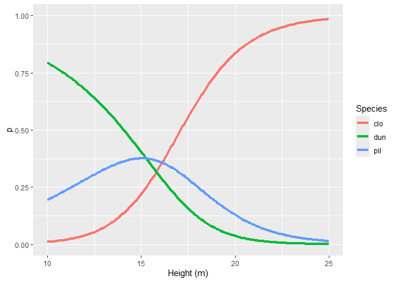

Multinomial logit
================
2024-10-01

Let’s fit the multinomial logit model on the eucalyptus data.

``` r
library(nnet)
library(tidyverse)

d <- read.csv("datasets/eucalyptus.csv")
anova(lm(hgt ~ spp, data = d))
```

    ## Analysis of Variance Table
    ## 
    ## Response: hgt
    ##            Df  Sum Sq Mean Sq F value    Pr(>F)    
    ## spp         2  368.29 184.145  78.653 < 2.2e-16 ***
    ## Residuals 717 1678.67   2.341                      
    ## ---
    ## Signif. codes:  0 '***' 0.001 '**' 0.01 '*' 0.05 '.' 0.1 ' ' 1

ANOVA found that the differences between species in terms of average
height is statistically significant. So, let’s use height to classify
the trees into species with multinomial logit.

``` r
m <- multinom(spp ~ hgt, data = d)
```

    ## # weights:  9 (4 variable)
    ## initial  value 791.000848 
    ## final  value 719.518148 
    ## converged

``` r
summary(m)
```

    ## Call:
    ## multinom(formula = spp ~ hgt, data = d)
    ## 
    ## Coefficients:
    ##     (Intercept)        hgt
    ## dun   11.828182 -0.7481619
    ## pil    7.746222 -0.4808776
    ## 
    ## Std. Errors:
    ##     (Intercept)        hgt
    ## dun    1.160214 0.07333266
    ## pil    1.055576 0.06537706
    ## 
    ## Residual Deviance: 1439.036 
    ## AIC: 1447.036

There are the coefficient estimates for `dun` and `pil` but none for
`clo` since `clo` is the reference. There are no p values in the table
as well. This is because it makes no sense to test individual
coefficients. If the variable $x$ is in the model, we have to
*simultaneously* test $G-1$ coefficients where $G$ is the total number
of groups.

To test the coefficients, we model without the coefficient and compare
both models with anova

``` r
m0 <- multinom(spp ~ 1, data = d)
```

    ## # weights:  6 (2 variable)
    ## initial  value 791.000848 
    ## final  value 791.000848 
    ## converged

``` r
anova(m0,m)
```

    ##   Model Resid. df Resid. Dev   Test    Df LR stat. Pr(Chi)
    ## 1     1      1438   1582.002           NA       NA      NA
    ## 2   hgt      1436   1439.036 1 vs 2     2 142.9654       0

``` r
lapply(list("no coef" = m0, coef = m), AIC)
```

    ## $`no coef`
    ## [1] 1586.002
    ## 
    ## $coef
    ## [1] 1447.036

It appears that there is a statistically significant difference between
the two models. The height of the tree does affect the probability of
belonging to a particular species.

## Plots

Let’s plot the result of multinomial:

``` r
d.pred <- data.frame(hgt = seq(10,25,.1))

matrix.prob <- predict(m,d.pred, type ="probs")

d2 <- expand.grid(hgt = seq(10,25,.1),
                  Species = c("clo","dun","pil"))

d2$p <- c(matrix.prob)

d2 %>%
  ggplot(aes(x = hgt, y = p, group = Species))+
  geom_line(aes(col = Species),linewidth = 1.5)+
  xlab("Height (m)")+
  ylim(c(0,1))
```

<!-- -->

Based on the graph, trees should be `dun` when the height is less than
around 15 m., `pil` when the height is between 15 - 16 m., and `clo`
otherwise.

We can check the goodness of fit of the model with apparent error ratio
(AER). Let’s start by recording the predicted values and creating the
*confusionn matrix*.

``` r
pred <- predict(m)
table(d$spp,pred)
```

    ##      pred
    ##       clo dun pil
    ##   clo 155  57  28
    ##   dun  31 142  67
    ##   pil  74  98  68

The confusion matrix is a contingency table of observed vs. predicted
data. The diagonal is the correctly predicted cases. Others are errors.
So, we can get AER by $AER = \frac{error}{total}$.

``` r
mean(pred != d$spp)
```

    ## [1] 0.4930556

So, $49.31\%$ of all observations is incorrectly predicted. Not so good
model…

Even the 1-way anova tells us that the differences between species and
height are highly statistically significant on the probability of
belonging to a particular species, the classification results still does
not perform well.

**Statistical significance is not everything.**
