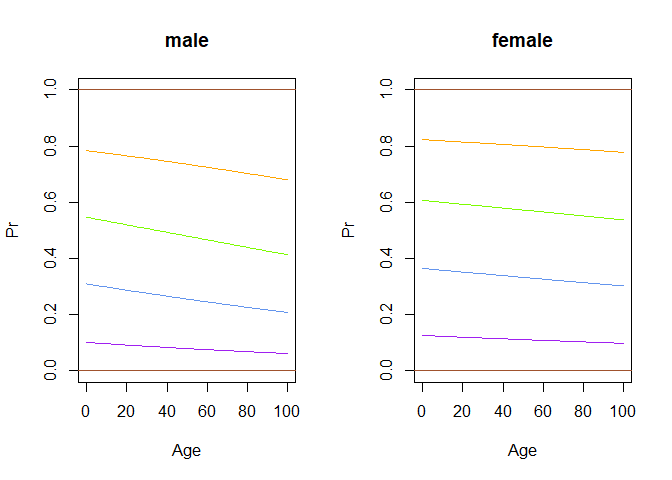

Ordered logit assessment
================
2024-10-01

## Assessment

Use the lego dataset to test whether the effect of age on the assigned
strength of emotion is modified by the sex of the participant.

``` r
library(tidyverse)
library(MASS)

d <- read.csv("datasets/lego.csv")
d$strength <- factor(d$strength,ordered = T)
summary(d)
```

    ##      sex                 age          emotion          strength   
    ##  Length:5640        Min.   :18.00   Length:5640        1   : 877  
    ##  Class :character   1st Qu.:30.00   Class :character   2   :1499  
    ##  Mode  :character   Median :36.00   Mode  :character   3   :1349  
    ##                     Mean   :38.29                      4   :1091  
    ##                     3rd Qu.:47.00                      5   : 822  
    ##                     Max.   :66.00                      NA's:   2  
    ##                     NA's   :94                                    
    ##       FID            PID       
    ##  Min.   : 1.0   Min.   : 1.00  
    ##  1st Qu.:24.0   1st Qu.:15.75  
    ##  Median :47.5   Median :30.50  
    ##  Mean   :47.5   Mean   :30.50  
    ##  3rd Qu.:71.0   3rd Qu.:45.25  
    ##  Max.   :94.0   Max.   :60.00  
    ## 

``` r
m.add <- polr(strength ~ age+sex, data = d,subset = !is.na(age))
m.int <- update(m.add,.~age*sex)
anova(m.add,m.int)
```

    ## Likelihood ratio tests of ordinal regression models
    ## 
    ## Response: strength
    ##                 Model Resid. df Resid. Dev   Test    Df  LR stat.   Pr(Chi)
    ## 1           age + sex      5538   17505.20                                 
    ## 2 age + sex + age:sex      5537   17504.97 1 vs 2     1 0.2307957 0.6309344

In other words are the models strength ~ age\*sex and strength ~ age+sex
statitsically significantly different?  
- From the anova, the models are not statistically significantly
different.

Use the model output to produce the plot of the cumulative probabilities
for each strength category by age and sex.

``` r
expit <- function(x){1/(1+exp(-(x)))}

par(mfrow=c(1,2))
# male
curve(expit(m.int$zeta[1]+coef(m.int)[1]*x+coef(m.int)[2]+coef(m.int)[3]*x),
      from=0,to=100,col='purple',
      ylim=c(0,1),xlab='Age',ylab='Pr', main = "male")
curve(expit(m.int$zeta[2]+coef(m.int)[1]*x+coef(m.int)[2]+coef(m.int)[3]*x),
      from=0,to=100,col='cornflowerblue',add=T)
curve(expit(m.int$zeta[3]+coef(m.int)[1]*x+coef(m.int)[2]+coef(m.int)[3]*x),
      from=0,to=100,col='lawngreen',add=T)
curve(expit(m.int$zeta[4]+coef(m.int)[1]*x+coef(m.int)[2]+coef(m.int)[3]*x),
      from=0,to=100,col='orange',add=T)
abline(h=0, col='sienna'); abline(h=1, col='sienna')

# female
curve(expit(m.int$zeta[1]+coef(m.int)[1]*x),
      from=0,to=100,col='purple',
      ylim=c(0,1),xlab='Age',ylab='Pr', main = "female")
curve(expit(m.int$zeta[2]+coef(m.int)[1]*x),
      from=0,to=100,col='cornflowerblue',add=T)
curve(expit(m.int$zeta[3]+coef(m.int)[1]*x),
      from=0,to=100,col='lawngreen',add=T)
curve(expit(m.int$zeta[4]+coef(m.int)[1]*x),
      from=0,to=100,col='orange',add=T)
abline(h=0, col='sienna'); abline(h=1, col='sienna')
```

<!-- -->

Produce the confusion matrix. What do you think about the fit of your
model? Is it a good/useful model?

``` r
pred <- predict(m.int)
table(m.int$model$strength,pred, dnn = list("Actual","Predicted"))
```

    ##       Predicted
    ## Actual    1    2    3    4    5
    ##      1    0  859    0    0    0
    ##      2    0 1476    0    0    0
    ##      3    0 1326    0    0    0
    ##      4    0 1071    0    0    0
    ##      5    0  812    0    0    0

``` r
mean(as.numeric(pred) != as.numeric(m.int$model$strength))
```

    ## [1] 0.7337662

The model is pretty bad. It cannot predict other strength other than 2.
The error rate is 73.38%.

Based on your modeling, what is the probability that a 40 year-old man
will assign an emotion of random lego figurine into the maximum strength
(5) category?

``` r
predict(m.int,newdata=data.frame(age = 40,sex = "M"), type = "probs")
```

    ##         1         2         3         4         5 
    ## 0.1859982 0.2906663 0.2331942 0.1707496 0.1193916

According to the model, the probability of a 40 year-old man assigning
an emotion of random lego figurine into emotion strength of 5 is 11.94%.
