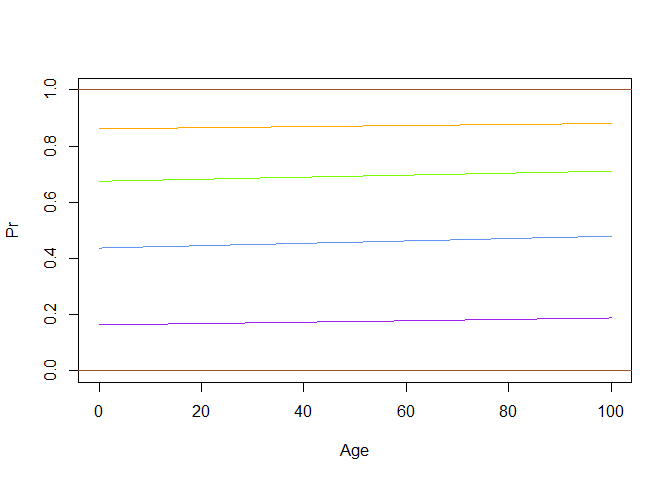

Ordered Logit
================
2024-10-01

## Fitting proportional hazards ordinal logit regression

We use data on people’s perception of emotion of Lego faces.

``` r
library(tidyverse)
library(MASS)

d <- read.csv("datasets/lego.csv")
# define strength of emotion as ordered factor
d$strength <- factor(d$strength, ordered = T)
summary(d)
```

    ##      sex                 age          emotion          strength   
    ##  Length:5640        Min.   :18.00   Length:5640        1   : 877  
    ##  Class :character   1st Qu.:30.00   Class :character   2   :1499  
    ##  Mode  :character   Median :36.00   Mode  :character   3   :1349  
    ##                     Mean   :38.29                      4   :1091  
    ##                     3rd Qu.:47.00                      5   : 822  
    ##                     Max.   :66.00                      NA's:   2  
    ##                     NA's   :94                                    
    ##       FID            PID       
    ##  Min.   : 1.0   Min.   : 1.00  
    ##  1st Qu.:24.0   1st Qu.:15.75  
    ##  Median :47.5   Median :30.50  
    ##  Mean   :47.5   Mean   :30.50  
    ##  3rd Qu.:71.0   3rd Qu.:45.25  
    ##  Max.   :94.0   Max.   :60.00  
    ## 

## Fitting the model

``` r
m <- polr(strength ~ age, data = d)
summary(m)
```

    ## 
    ## Re-fitting to get Hessian

    ## Call:
    ## polr(formula = strength ~ age, data = d)
    ## 
    ## Coefficients:
    ##        Value Std. Error t value
    ## age 0.001705   0.001959  0.8702
    ## 
    ## Intercepts:
    ##     Value    Std. Error t value 
    ## 1|2  -1.6312   0.0835   -19.5380
    ## 2|3  -0.2528   0.0797    -3.1731
    ## 3|4   0.7301   0.0801     9.1102
    ## 4|5   1.8279   0.0842    21.7121
    ## 
    ## Residual Deviance: 17544.61 
    ## AIC: 17554.61 
    ## (96 observations deleted due to missingness)

From the proportion hazards, the slope of the independent variable is
equal: $\beta_1 = \beta_2 = \ldots =\beta_n$ where $n$ is number of
ordinal rank - 1.

``` r
expit <- function(x){1/(1+exp(-(x)))}

curve(expit(-1.6312+0.0017*x),from=0,to=100,col='purple',
      ylim=c(0,1),xlab='Age',ylab='Pr')
curve(expit(-0.2528+0.0017*x),from=0,to=100,col='cornflowerblue',add=T)
curve(expit( 0.7301+0.0017*x),from=0,to=100,col='lawngreen',add=T)
curve(expit( 1.8279+0.0017*x),from=0,to=100,col='orange',add=T)
abline(h=0, col='sienna'); abline(h=1, col='sienna')
```

<!-- -->

Seems like age does not matter in this case.

## Interpretation of the coefficients

The coefficient of the age is 0.0017047. How do we interpret this.
Recall the log-odds interpretation:  
*Each additional year of age is associated with an average 0.17%
increase in the odds of choosing a higher strength category.*

Is the effect statistically significant? The model does not give us
p-value, but we can use `anova()` for the model with and without the
variable of interest.

``` r
anova(m,update(m,.~1,data = d, subset= !is.na(age)))
```

    ## Likelihood ratio tests of ordinal regression models
    ## 
    ## Response: strength
    ##   Model Resid. df Resid. Dev   Test    Df  LR stat.   Pr(Chi)
    ## 1     1      5540   17545.37                                 
    ## 2   age      5539   17544.61 1 vs 2     1 0.7571505 0.3842217

ANOVA tells us that age does not have a significant effect on percieved
strength of emotion.

## More complex model

We can use other factor as well. Let’s see the association between age
and emotion to strength of emotion perceived:

``` r
m2 <- polr(strength ~ age*emotion, data = d)
m3 <- update(m2,.~emotion,subset=!is.na(age))
anova(m2,m3)
```

    ## Likelihood ratio tests of ordinal regression models
    ## 
    ## Response: strength
    ##           Model Resid. df Resid. Dev   Test    Df LR stat.      Pr(Chi)
    ## 1       emotion      5535   17464.82                                   
    ## 2 age * emotion      5529   17435.13 1 vs 2     6 29.69172 4.498337e-05
