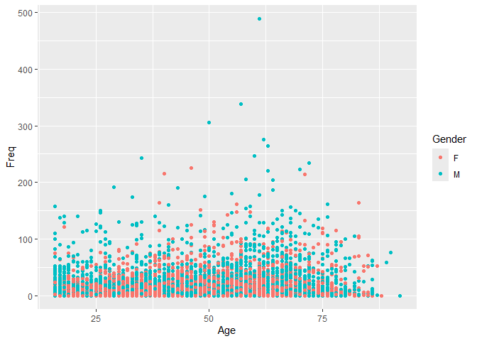
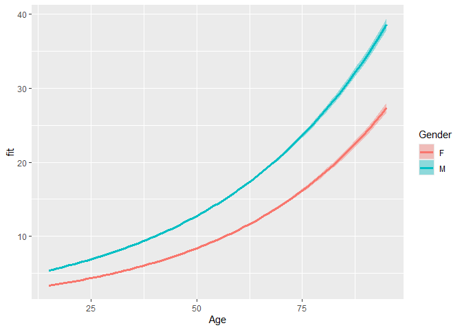

Poisson regression
================
2024-09-28

## Load packages and data

``` r
library(tidyverse)
df <- read.csv(file = "datasets/LLGA.csv")
head(df)
```

    ##   memMemberNo Gender Age  StartDate BMI Freq
    ## 1           1      F  83  9/04/2014  NA   14
    ## 2           2      F  19  5/02/2014  NA    1
    ## 3           3      F  79 19/02/2015  NA    1
    ## 4           4      F  42  3/06/2014  NA    5
    ## 5           5      F  21  5/02/2014  NA    1
    ## 6           6      F  55 10/12/2014  NA   18

The study looked at the possible effect of the environment on attendance
of various sports facilities. This simplified dataset contains
information on gender and age of the participants, the dates they
started their participation (i.e., their first visit), the body mass
index for some of them, and the number of times (Freq) they visited the
sports facilities during the study period (April 2015 – March 2016).

## Exploratory analysis

Let’s see if the number of visits correlated with gender and age. First,
take a look at the demographic

``` r
table(df$Gender)
```

    ## 
    ##           F     M     U 
    ##     1 11354  7745    42

There is 1 missing value and 42 unknowns. Let’s omit these response.

``` r
df %>%
  filter(Gender %in% c("F","M")) -> d

d %>%
  ggplot(aes(x=Age))+
  geom_density(aes(fill = Gender,group = Gender, col = Gender),alpha = .4)
```

<!-- -->

Most people are in working age (25 - 40). Let’s take a look at frequency
of visits.

``` r
d %>%
  ggplot(aes(x=Age, y = Freq))+
  geom_point(aes(col = Gender, group = Gender))
```

<!-- -->

Only take away with this graph is that there is a lot of variations. One
of the sample visits almost 500 times. This is our outlier.

## Fitting poisson regression

Fitting poisson regression require family parameter and link function
(log).

``` r
p <- glm(Freq ~ Gender*Age, data = d, 
         family = "poisson"(link = "log"))
summary(p)
```

    ## 
    ## Call:
    ## glm(formula = Freq ~ Gender * Age, family = poisson(link = "log"), 
    ##     data = d)
    ## 
    ## Coefficients:
    ##               Estimate Std. Error z value Pr(>|z|)    
    ## (Intercept)  0.8083222  0.0106255  76.073  < 2e-16 ***
    ## GenderM      0.5034879  0.0144731  34.788  < 2e-16 ***
    ## Age          0.0263338  0.0002211 119.109  < 2e-16 ***
    ## GenderM:Age -0.0016700  0.0002973  -5.617 1.95e-08 ***
    ## ---
    ## Signif. codes:  0 '***' 0.001 '**' 0.01 '*' 0.05 '.' 0.1 ' ' 1
    ## 
    ## (Dispersion parameter for poisson family taken to be 1)
    ## 
    ##     Null deviance: 306153  on 19098  degrees of freedom
    ## Residual deviance: 269730  on 19095  degrees of freedom
    ## AIC: 329747
    ## 
    ## Number of Fisher Scoring iterations: 6

With this large amount of data, everything is significant as expected.
We can interpret the model as:  
For women, additional of age is associated with an average of
$e^{0.026}-1 = 2.63%$ increase in frequency of visit.  
For men, the correlation between age and frequency is 0.17% smaller
(coefficient of the interaction terms).

Does the relationship differ by gender? Let’s compare the model with out
gender.

``` r
anova(update(p,.~Age),p,test = "Chisq")
```

    ## Analysis of Deviance Table
    ## 
    ## Model 1: Freq ~ Age
    ## Model 2: Freq ~ Gender * Age
    ##   Resid. Df Resid. Dev Df Deviance  Pr(>Chi)    
    ## 1     19097     276969                          
    ## 2     19095     269730  2   7238.1 < 2.2e-16 ***
    ## ---
    ## Signif. codes:  0 '***' 0.001 '**' 0.01 '*' 0.05 '.' 0.1 ' ' 1

The difference is significant. We can say that the relationship is
different on each gender.

## Plotting the fit

We can use predict to fit the curve of the model.

``` r
d.pred <- data.frame(Age = rep(15:95,each = 2),Gender = rep(c("F","M"),81)) %>%
  cbind(predict(p,newdata = list(Age = rep(15:95,each = 2),
                                 Gender = rep(c("F","M"),81)),
                type = "response",
                se.fit = T)) %>%
  select(-residual.scale) %>%
  mutate(lo = fit-(1.96*se.fit),
         hi = fit+(1.96*se.fit))

d.pred %>%
  ggplot(aes(x = Age, y = fit))+
  geom_line(aes(group = Gender, colour = Gender),linewidth = 1.5)
```

<!-- -->

``` r
d.pred |> 
  ggplot(aes(x=Age , y=fit))+
  geom_line(aes(group = Gender , col = Gender),linewidth = 1.2)+
  geom_ribbon(aes(ymin = lo, ymax=hi,group=Gender, fill = Gender),alpha=.4)
```

<!-- -->

## Offset

The total frequency is collected at 1st April 2016. By this fact, the
frequency is offset by duration of participation. Our model should
account for this. Thus it should change from

$$
Y_i\sim Pois(\mu_i)
$$

to:

$$
Y_i\sim Pois(\mu_{d_i},N_{d_i})
$$

where $\mu_{d_i}$ is the daily frequency of visits and $N_{d_i}$ is the
total number of days available for visits. We can model the intensity
parameters as:

$$
\log(\mu_{i})=\log(\mu_{d_i})+\log(N_{d_i})=\beta_0+\beta_1X_{1i}+\ldots+\log(N_{d_i})
$$

$\log(N_{d_i})$ has a coefficient of 1 so we called it an offset.

We need to calculate the values of this variable:

``` r
d %>%
  mutate(duration = days(dmy("1/4/2016")-dmy(StartDate)),
         duration = pmin(as.numeric(duration),365)) %>% 
  filter(duration >0) ->d1
```

Now, let’s make a new model:

``` r
m <- update(p,.~.+offset(log(duration)),
            data = d1, family = "poisson"(link = "log"))
summary(m)
```

    ## 
    ## Call:
    ## glm(formula = Freq ~ Gender + Age + Gender:Age + offset(log(duration)), 
    ##     family = poisson(link = "log"), data = d1)
    ## 
    ## Coefficients:
    ##               Estimate Std. Error  z value Pr(>|z|)    
    ## (Intercept) -5.0915752  0.0106255 -479.183  < 2e-16 ***
    ## GenderM      0.5040342  0.0144736   34.824  < 2e-16 ***
    ## Age          0.0263338  0.0002211  119.109  < 2e-16 ***
    ## GenderM:Age -0.0016789  0.0002973   -5.646 1.64e-08 ***
    ## ---
    ## Signif. codes:  0 '***' 0.001 '**' 0.01 '*' 0.05 '.' 0.1 ' ' 1
    ## 
    ## (Dispersion parameter for poisson family taken to be 1)
    ## 
    ##     Null deviance: 306136  on 19096  degrees of freedom
    ## Residual deviance: 269718  on 19093  degrees of freedom
    ## AIC: 329729
    ## 
    ## Number of Fisher Scoring iterations: 6

``` r
lapply(list(poisson = p,offset = m), AIC)
```

    ## $poisson
    ## [1] 329746.7
    ## 
    ## $offset
    ## [1] 329729.2
