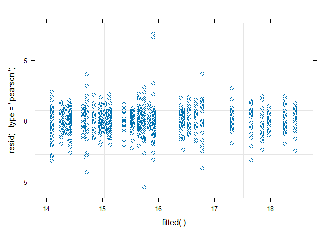
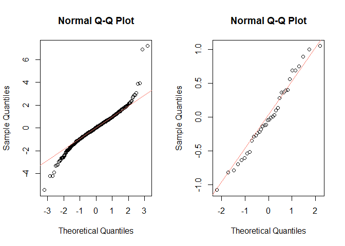

Paired test
================

Consider a data set with variables $G$, $Y$, and $PID$. Let $G$ be a
binary variable such that $G_i = 0$ or $G_i = 1$ for depending on which
group the observation $i$ belongs to. Let $PID$ be the personal ID of
the participant to which the observation $i$ refers. And, finally, let
$Y_i$ be the response recorded for the observation $i$ (For the person
$PID_i$ belonging to the group $G_i$).

Performing a simple t-test (with the assumption of equal variance) is
equivalent to fitting a simple linear regression with response $Y$ and a
single binary covariate $G$, and testing the coefficient of $G$.

Use the file BPData.csv to give it a go.

``` r
library(tidyverse)
df <- read.csv("datasets/BPdata.csv")
# check whether has separated
head(df)
```

    ##   X PID  Group    BP
    ## 1 1   1 Before 143.9
    ## 2 2   2 Before 135.9
    ## 3 3   3 Before 146.4
    ## 4 4   4 Before 139.4
    ## 5 5   5 Before 140.6
    ## 6 6   6 Before 139.7

``` r
m <- lm(BP ~ Group, data = df)
summary(m)
```

    ## 
    ## Call:
    ## lm(formula = BP ~ Group, data = df)
    ## 
    ## Residuals:
    ##    Min     1Q Median     3Q    Max 
    ## -5.100 -1.913  0.250  2.075  6.350 
    ## 
    ## Coefficients:
    ##             Estimate Std. Error t value Pr(>|t|)    
    ## (Intercept)  138.750      1.028 135.026   <2e-16 ***
    ## GroupBefore    2.250      1.453   1.548    0.139    
    ## ---
    ## Signif. codes:  0 '***' 0.001 '**' 0.01 '*' 0.05 '.' 0.1 ' ' 1
    ## 
    ## Residual standard error: 3.249 on 18 degrees of freedom
    ## Multiple R-squared:  0.1175, Adjusted R-squared:  0.0685 
    ## F-statistic: 2.397 on 1 and 18 DF,  p-value: 0.139

``` r
t.test(BP ~ Group , data = df, var.equal = T)
```

    ## 
    ##  Two Sample t-test
    ## 
    ## data:  BP by Group
    ## t = -1.5483, df = 18, p-value = 0.139
    ## alternative hypothesis: true difference in means between group After and group Before is not equal to 0
    ## 95 percent confidence interval:
    ##  -5.3030911  0.8030911
    ## sample estimates:
    ##  mean in group After mean in group Before 
    ##               138.75               141.00

This simple regression assumes that:

$$
Y_i = a+bX_i+\varepsilon_i
$$

where

$$
\varepsilon_i \sim N(0,\sigma^2)
$$ However, blood pressure test measurement might vary between
participants. We call this mixed effect. The model is:

$$
Y_i = a+bX_i+\xi_{PID_i} + \varepsilon_i
$$

The participant error term $\xi_{PID_i}$ is distributed as:

$$
\xi_{PID} \sim N(0,\omega^2)
$$

The $\varepsilon_i$ is still the same. Now, the expected Y given X has
to take account for participant error. Thus, the variance is then:

$$
Var(Y|X)=Var(a+bX^*+\xi_{PID_i}+\varepsilon_i)=\omega^2+\sigma^2
$$

Let’s try to fit the model. We are going to use `lme4` and `lmerTest`
for the mixed effect model.

``` r
library(lme4)
library(lmerTest)

m1 <- lmer(BP ~ Group + (1|PID), data = df)
summary(m1)
```

    ## Linear mixed model fit by REML. t-tests use Satterthwaite's method [
    ## lmerModLmerTest]
    ## Formula: BP ~ Group + (1 | PID)
    ##    Data: df
    ## 
    ## REML criterion at convergence: 73.9
    ## 
    ## Scaled residuals: 
    ##     Min      1Q  Median      3Q     Max 
    ## -1.1011 -0.4666  0.0109  0.4447  1.1026 
    ## 
    ## Random effects:
    ##  Groups   Name        Variance Std.Dev.
    ##  PID      (Intercept) 10.1956  3.193   
    ##  Residual              0.3636  0.603   
    ## Number of obs: 20, groups:  PID, 10
    ## 
    ## Fixed effects:
    ##             Estimate Std. Error       df t value Pr(>|t|)    
    ## (Intercept) 138.7500     1.0276   9.3153 135.026  < 2e-16 ***
    ## GroupBefore   2.2500     0.2697   9.0000   8.344 1.58e-05 ***
    ## ---
    ## Signif. codes:  0 '***' 0.001 '**' 0.01 '*' 0.05 '.' 0.1 ' ' 1
    ## 
    ## Correlation of Fixed Effects:
    ##             (Intr)
    ## GroupBefore -0.131

The data set is very small. We cannot see much of the difference.

## Repeated measures ANOVA

If we want to compare means of more than two groups, we use ANOVA. In
this case, we can use repeated ANOVA to compare the means rather than
paired - t-test.

``` r
ed <- read.csv("datasets/eucalyptus.csv")
head(ed)
```

    ##   plot stocking oldtree spp  hgt  dbh gr_hgt rad_B rad_W rad_hgt     taper
    ## 1    2      714      N1 clo 13.4 15.6    1.2   6.0   5.5     1.5 0.8589744
    ## 2    2      714     N10 clo 13.7 14.6    1.3   5.7   5.0     4.6 0.9383562
    ## 3    2      714     N11 clo 15.3 15.0    3.6   3.5   2.7     5.7 1.0200000
    ## 4    2      714     N12 clo 13.5 14.4    1.5   5.0   4.5     5.2 0.9375000
    ## 5    2      714     N13 clo 14.8 17.6    1.0   6.0   6.5     3.9 0.8409091
    ## 6    2      714     N14 clo 13.9 18.3    2.3   6.5   5.0     4.8 0.7595628
    ##   Stiffness tree basicdens   nstiff crownarea plotdbh dbhdev
    ## 1  10.77454    1       536 30.15263 104.06550   16.58  -0.98
    ## 2  13.04936   10       522 37.49817  90.30529   16.58  -1.98
    ## 3  13.71328   11       561 36.66652  30.69343   16.58  -1.58
    ## 4  12.14702   12       497 36.66103  71.07870   16.58  -2.18
    ## 5  13.86822   13       556 37.41425 122.91510   16.58   1.02
    ## 6  13.41409   14       518 38.84390 105.63630   16.58   1.72

In this dataset, we have information on the height(`hgt`), the species
(`spp`), and the `stocking` density. If we want to know whether the tree
height depends on the planting density (`stocking`) and species, we need
to account for the `plot`.

Our model should be:

$$
H = \mu_{spp_i,stocking_i}+\xi_{plot_i}+\varepsilon_i
$$

Let’s try to fit the model.

## Height model

``` r
ed$stocking <- factor(ed$stocking)

m1 <- lmer(hgt ~ spp*stocking + (1|plot), data = ed)
m0 <- lmer(hgt ~ spp + (1|plot), data = ed)
anova(m1,m0)
```

    ## refitting model(s) with ML (instead of REML)

    ## Data: ed
    ## Models:
    ## m0: hgt ~ spp + (1 | plot)
    ## m1: hgt ~ spp * stocking + (1 | plot)
    ##    npar    AIC    BIC  logLik deviance  Chisq Df Pr(>Chisq)    
    ## m0    5 2372.2 2395.2 -1181.1   2362.2                         
    ## m1   14 2352.6 2416.7 -1162.3   2324.6 37.618  9   2.04e-05 ***
    ## ---
    ## Signif. codes:  0 '***' 0.001 '**' 0.01 '*' 0.05 '.' 0.1 ' ' 1

Seems like the stocking has a statistically significant effect on
average tree heights.

Let’s look at the variance of model 1

``` r
summary(m1)
```

    ## Linear mixed model fit by REML. t-tests use Satterthwaite's method [
    ## lmerModLmerTest]
    ## Formula: hgt ~ spp * stocking + (1 | plot)
    ##    Data: ed
    ## 
    ## REML criterion at convergence: 2325.6
    ## 
    ## Scaled residuals: 
    ##     Min      1Q  Median      3Q     Max 
    ## -4.6761 -0.5411  0.0330  0.5629  6.1691 
    ## 
    ## Random effects:
    ##  Groups   Name        Variance Std.Dev.
    ##  plot     (Intercept) 0.4811   0.6936  
    ##  Residual             1.3588   1.1657  
    ## Number of obs: 720, groups:  plot, 36
    ## 
    ## Fixed effects:
    ##                     Estimate Std. Error      df t value Pr(>|t|)    
    ## (Intercept)          14.9100     0.4278 24.0000  34.854  < 2e-16 ***
    ## sppdun               -0.4583     0.6050 24.0000  -0.758 0.456067    
    ## spppil                0.2800     0.6050 24.0000   0.463 0.647661    
    ## stocking1000          2.6600     0.6050 24.0000   4.397 0.000193 ***
    ## stocking1667          3.1850     0.6050 24.0000   5.265 2.13e-05 ***
    ## stocking3333          1.3567     0.6050 24.0000   2.242 0.034435 *  
    ## sppdun:stocking1000  -1.9267     0.8556 24.0000  -2.252 0.033752 *  
    ## spppil:stocking1000  -2.3500     0.8556 24.0000  -2.747 0.011233 *  
    ## sppdun:stocking1667  -2.2433     0.8556 24.0000  -2.622 0.014941 *  
    ## spppil:stocking1667  -1.8100     0.8556 24.0000  -2.116 0.044953 *  
    ## sppdun:stocking3333  -0.8683     0.8556 24.0000  -1.015 0.320271    
    ## spppil:stocking3333  -1.5850     0.8556 24.0000  -1.853 0.076284 .  
    ## ---
    ## Signif. codes:  0 '***' 0.001 '**' 0.01 '*' 0.05 '.' 0.1 ' ' 1
    ## 
    ## Correlation of Fixed Effects:
    ##             (Intr) sppdun spppil st1000 st1667 st3333 sppd:1000 sppp:1000
    ## sppdun      -0.707                                                       
    ## spppil      -0.707  0.500                                                
    ## stockng1000 -0.707  0.500  0.500                                         
    ## stockng1667 -0.707  0.500  0.500  0.500                                  
    ## stockng3333 -0.707  0.500  0.500  0.500  0.500                           
    ## sppdn:s1000  0.500 -0.707 -0.354 -0.707 -0.354 -0.354                    
    ## spppl:s1000  0.500 -0.354 -0.707 -0.707 -0.354 -0.354  0.500             
    ## sppdn:s1667  0.500 -0.707 -0.354 -0.354 -0.707 -0.354  0.500     0.250   
    ## spppl:s1667  0.500 -0.354 -0.707 -0.354 -0.707 -0.354  0.250     0.500   
    ## sppdn:s3333  0.500 -0.707 -0.354 -0.354 -0.354 -0.707  0.500     0.250   
    ## spppl:s3333  0.500 -0.354 -0.707 -0.354 -0.354 -0.707  0.250     0.500   
    ##             sppd:1667 sppp:1667 sppd:3333
    ## sppdun                                   
    ## spppil                                   
    ## stockng1000                              
    ## stockng1667                              
    ## stockng3333                              
    ## sppdn:s1000                              
    ## spppl:s1000                              
    ## sppdn:s1667                              
    ## spppl:s1667  0.500                       
    ## sppdn:s3333  0.500     0.250             
    ## spppl:s3333  0.250     0.500     0.500

``` r
ranef(m1)
```

    ## $plot
    ##     (Intercept)
    ## 2   -0.81491441
    ## 7   -0.53597418
    ## 12   0.13873991
    ## 15   0.99892735
    ## 16  -0.78424559
    ## 17   0.68785787
    ## 18   0.09638773
    ## 19  -0.12267529
    ## 20   0.35926334
    ## 21  -0.23658806
    ## 23   0.39723427
    ## 24  -0.18401293
    ## 26   0.56080132
    ## 27   0.74919551
    ## 28   1.04712121
    ## 29   0.03066882
    ## 30  -1.07779003
    ## 31  -0.69808081
    ## 32  -0.63528274
    ## 33  -0.11391277
    ## 34   0.69077871
    ## 41  -0.51260745
    ## 42   0.00730210
    ## 49  -0.04819386
    ## 76   0.39285301
    ## 77   0.27747982
    ## 78   0.35926334
    ## 79  -0.00730210
    ## 80  -0.13581907
    ## 81  -0.28478192
    ## 82  -0.27017772
    ## 83  -0.04089176
    ## 84  -0.22344427
    ## 85  -0.35196124
    ## 87   0.89377710
    ## 102 -0.60899518
    ## 
    ## with conditional variances for "plot"

Look at the variance of the plot in random effect. If it is near 0, we
can say that the plots are pretty much identical. However, in this case,
the variance of the plot is around 37.30% which is quite high.

## Diagnostics

Let’s diagnose the model. We want equal variance and normal distribution
for both residuals and random effects.

``` r
# check variance with plot
plot(m1)
```

<!-- -->

``` r
# check normality with qqplot
par(mfrow = c(1,2))
qqnorm(resid(m1))
qqline(resid(m1),col = "salmon")

qqnorm(c(unlist(ranef(m1)$plot)))
qqline(c(unlist(ranef(m1)$plot)), col = "salmon")
```

<!-- -->

## Comparison with no random effects

Let’s check the model with no random effects:

``` r
m1s <- lm(hgt ~ spp*stocking, data = ed)
m0s <- lm(hgt ~ spp, data = ed)
anova(m1s,m0s)
```

    ## Analysis of Variance Table
    ## 
    ## Model 1: hgt ~ spp * stocking
    ## Model 2: hgt ~ spp
    ##   Res.Df    RSS Df Sum of Sq      F    Pr(>F)    
    ## 1    708 1192.9                                  
    ## 2    717 1678.7 -9   -485.74 32.032 < 2.2e-16 ***
    ## ---
    ## Signif. codes:  0 '***' 0.001 '**' 0.01 '*' 0.05 '.' 0.1 ' ' 1

In this case, the result is similar.
