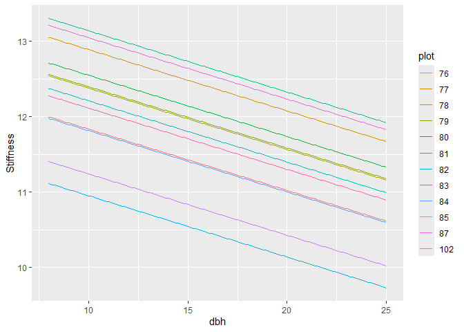

Random Intercepts and Random Slopes
================
2024-09-30

Random effect with linear regression looks like this:

$$
Y_i=\beta_0+\beta_1X_{1i}+\beta_2X_{2i}+\ldots+\beta_kX_{ki}+\xi_{ID_i}+\varepsilon_i
$$

with $\xi$ as a random effect (ID specific)

Let’s use eucalypti data to fit a simple regression with stiffness as
the response and dbh as the independent variable. For simplicity, use
only `dun` species. We will add specific random effect plot to the
diagnostic.

``` r
library(tidyverse)
library(lme4)
library(lmerTest)

df <- read.csv("datasets/eucalyptus.csv")
df %>%
  mutate(stocking = factor(stocking)) %>%
  filter(spp == "dun") -> df
```

``` r
m <- lmer(Stiffness ~ dbh + (1|plot), data = df)
summary(m)
```

    ## Linear mixed model fit by REML. t-tests use Satterthwaite's method [
    ## lmerModLmerTest]
    ## Formula: Stiffness ~ dbh + (1 | plot)
    ##    Data: df
    ## 
    ## REML criterion at convergence: 886.9
    ## 
    ## Scaled residuals: 
    ##      Min       1Q   Median       3Q      Max 
    ## -2.87315 -0.67208 -0.09878  0.65897  2.87324 
    ## 
    ## Random effects:
    ##  Groups   Name        Variance Std.Dev.
    ##  plot     (Intercept) 0.5488   0.7408  
    ##  Residual             2.1251   1.4578  
    ## Number of obs: 240, groups:  plot, 12
    ## 
    ## Fixed effects:
    ##              Estimate Std. Error        df t value Pr(>|t|)    
    ## (Intercept)  13.02550    0.83094 196.93852  15.676   <2e-16 ***
    ## dbh          -0.08126    0.05406 235.83316  -1.503    0.134    
    ## ---
    ## Signif. codes:  0 '***' 0.001 '**' 0.01 '*' 0.05 '.' 0.1 ' ' 1
    ## 
    ## Correlation of Fixed Effects:
    ##     (Intr)
    ## dbh -0.960

``` r
ranef(m)
```

    ## $plot
    ##      (Intercept)
    ## 76  -0.379011030
    ## 77   0.674964547
    ## 78   0.164309638
    ## 79   0.183230881
    ## 80   0.335165575
    ## 81   0.925096956
    ## 82  -0.002912704
    ## 83  -1.261582175
    ## 84  -0.398695779
    ## 85  -0.972567568
    ## 87   0.832454197
    ## 102 -0.100452537
    ## 
    ## with conditional variances for "plot"

The association between `dbh` and `Stiffness` is not significant.
Inter-plot variation is substantial with about 25% of the unexplained
variation. `ranef(m)` showed us the random effects.

The word intercept means that the intercept is different for each plot.
Since $\xi_{ID_i}+\beta_0$ will be calculated as intercept.

Now let’s make a plot

``` r
d.pred <- expand.grid(dbh = seq(8,25,.1),
                      plot=factor(unique(df$plot)))
d.pred %>%
  bind_cols(predict(m,newdata = d.pred,se.fit = T)) -> d.pred

d.pred %>%
  ggplot(aes(x=dbh, y=fit, group = plot))+
  geom_line(aes(col = plot))+
  xlab("dbh")+
  ylab("Stiffness")
```

<!-- -->

We get 12 lines for each plot and they are parallel. But what if slope
of each plot is not the same

## Random slopes

We can fit a model with random slopes. Mathematically, it is:

$$
Y_i = (\beta_0+\xi_{ID_i})+(\beta_1+\omega_{ID_i}X_i+\varepsilon_i)
$$

This model can be fit with the following code:

``` r
m.slope <- lmer(Stiffness ~ dbh + (dbh|plot),data = df)
```

    ## Warning in checkConv(attr(opt, "derivs"), opt$par, ctrl = control$checkConv, :
    ## Model failed to converge with max|grad| = 0.00305996 (tol = 0.002, component 1)

``` r
summary(m.slope)
```

    ## Linear mixed model fit by REML. t-tests use Satterthwaite's method [
    ## lmerModLmerTest]
    ## Formula: Stiffness ~ dbh + (dbh | plot)
    ##    Data: df
    ## 
    ## REML criterion at convergence: 886.2
    ## 
    ## Scaled residuals: 
    ##     Min      1Q  Median      3Q     Max 
    ## -2.9671 -0.6836 -0.1054  0.6522  2.8883 
    ## 
    ## Random effects:
    ##  Groups   Name        Variance Std.Dev. Corr 
    ##  plot     (Intercept) 2.25407  1.5014        
    ##           dbh         0.01055  0.1027   -0.88
    ##  Residual             2.09278  1.4466        
    ## Number of obs: 240, groups:  plot, 12
    ## 
    ## Fixed effects:
    ##             Estimate Std. Error       df t value Pr(>|t|)    
    ## (Intercept) 13.06017    0.93471 15.26032  13.972 4.18e-10 ***
    ## dbh         -0.08268    0.06346 12.03779  -1.303    0.217    
    ## ---
    ## Signif. codes:  0 '***' 0.001 '**' 0.01 '*' 0.05 '.' 0.1 ' ' 1
    ## 
    ## Correlation of Fixed Effects:
    ##     (Intr)
    ## dbh -0.968
    ## optimizer (nloptwrap) convergence code: 0 (OK)
    ## Model failed to converge with max|grad| = 0.00305996 (tol = 0.002, component 1)

``` r
ranef(m.slope)
```

    ## $plot
    ##     (Intercept)          dbh
    ## 76   0.63848170 -0.061905172
    ## 77   0.09346231  0.039669036
    ## 78  -0.37416270  0.035856707
    ## 79   0.10275418  0.004683269
    ## 80  -0.45231351  0.053503256
    ## 81   0.71522208  0.014573347
    ## 82   0.23307214 -0.017693928
    ## 83  -0.04564856 -0.081620862
    ## 84   0.73327824 -0.079081742
    ## 85  -1.96806125  0.064235752
    ## 87   0.30540984  0.037799109
    ## 102  0.01850552 -0.010018770
    ## 
    ## with conditional variances for "plot"

Now our random effects has intercept and dbh for plot and residuals.
Note that variance of dbh is low relative to others. It means that the
slopes do not seem to vary too much between plots.

Random effect from `ranef` will have 2 values now. One for intercept and
one for dbh.

Let’s plot it out:

``` r
d.pred %>%
  select(-c(fit,se.fit)) %>%
  bind_cols(predict(m.slope, newdata=.,se.fit = T)) -> d.pred

d.pred %>%
  ggplot(aes(x=dbh, y= fit, group = plot))+
  geom_line(aes(col = plot))+
  xlab("dbh")+
  ylab("Stiffness")
```

<!-- -->

Let’s add a populaton average line to the plot:

``` r
d.pred.pop <- expand.grid(dbh = seq(8,25,.1),
                          plot= factor(unique(df$plot)))
d.pred.pop %>%
  mutate(fit = predict(m.slope,newdata = .,re.form = ~0)) -> d.pred.pop

d.pred %>%
  ggplot(aes(x = dbh, y = fit, group =plot))+
  geom_line(aes(col = plot))+
  geom_line(data = d.pred.pop, aes(x = dbh, y = fit), linewidth = 1.5)+
  xlab("dbh")+
  ylab("Stiffness")
```

<!-- -->

## Testing for random slopes

We can use AIC to check whether adding random slopes makes statistical
sense:

``` r
lapply(list("random effect" = m,
            "random slope" = m.slope), AIC)
```

    ## $`random effect`
    ## [1] 894.8972
    ## 
    ## $`random slope`
    ## [1] 898.1672

AIC for random effect without random slope is lower, so no evidence for
random slopes. We can use anova for the same test:

``` r
anova(m,m.slope)
```

    ## refitting model(s) with ML (instead of REML)

    ## Data: df
    ## Models:
    ## m: Stiffness ~ dbh + (1 | plot)
    ## m.slope: Stiffness ~ dbh + (dbh | plot)
    ##         npar    AIC    BIC  logLik deviance  Chisq Df Pr(>Chisq)
    ## m          4 889.77 903.70 -440.89   881.77                     
    ## m.slope    6 893.34 914.22 -440.67   881.34 0.4339  2      0.805

ANOVA test also shows that the random slope is not statistically
different to normal random effect.
