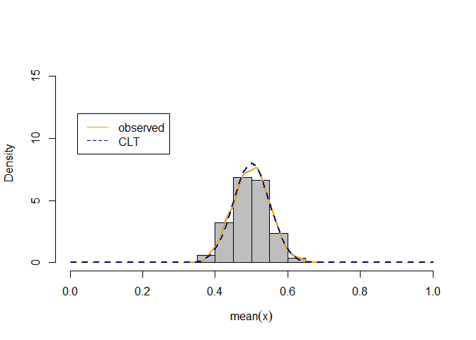
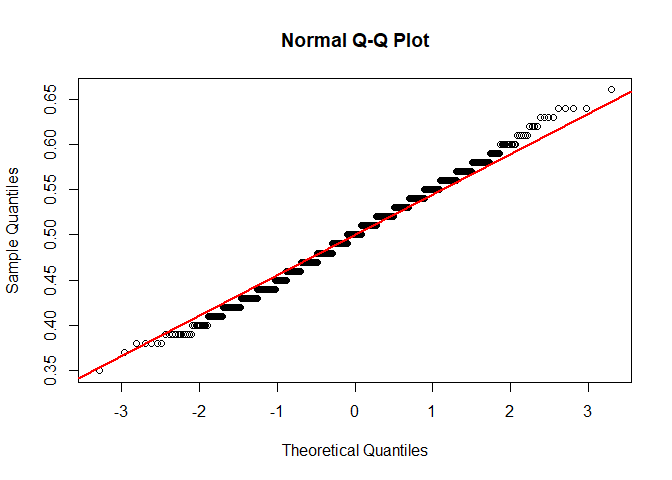
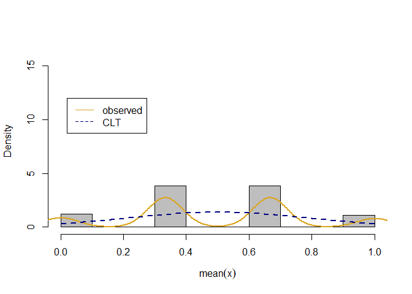
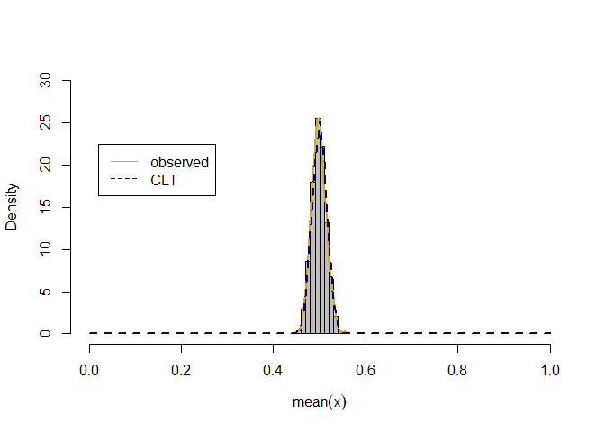
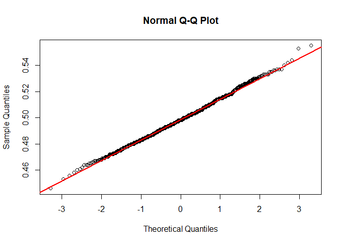
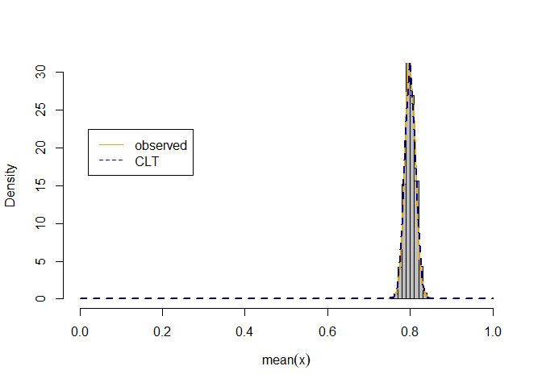
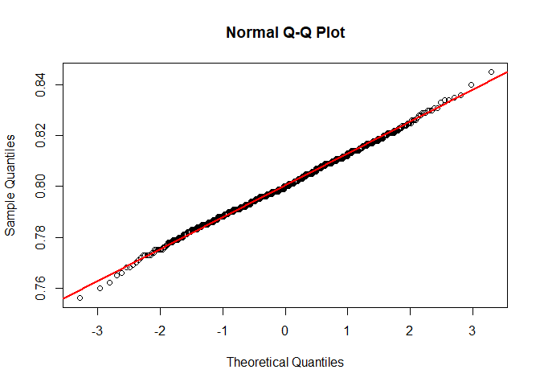

Simulations
================
Amnist.O
2024-09-09

# Assessment:

Using the simulation, investigate the problem below:

Consider a random sample of size $n$ from a Bernoulli distribution with
population proportion $p$. For different values of $n$ and $p$, check
whether the distribution of the sample mean $\bar{x}$ appears to be
normal.

Bernoulli distribution is discrete probability distribution which takes
the value 1 with probability $p$ and value 0 with probability $1-p$.
Bernoulli is binomial distribution with 1 trial.

``` r
bclt <- function(n, nsim, p) {
  x <- array(rbinom(n * nsim, 1, p), dim = c(nsim, n))
  mean.x <- apply(x, 1, mean)
  h = 16
  if (n > 100){
    h = 30
  }
  l = .02
  if (p < .5){
    l = .75
  }
  # plot distribution
  hist(
    mean.x,
    main = "",
    xlab = expression(mean(x)),
    col = "grey",
    freq = F,
    xlim = c(0, 1),
    ylim = c(0, h)
  )
  lines(density(mean.x), col = "goldenrod", lwd = 2)
  curve(
    dnorm(x, p, sd = sqrt(p*(1-p) / n)),
    add = T,
    col = "navyblue",
    lwd = 2,
    lty = 2
  )
  legend(
    l,
    h*3/4,
    col = c("goldenrod", "navyblue"),
    lty = c(1, 2),
    c("observed", "CLT")
  )
  
  # qqplot
  qqnorm(mean.x)
  qqline(mean.x, col = "red", lwd = 2)
}
```

With probability of 0.5 and large sample size of 100

``` r
bclt(100,1000,0.5)
```

<!-- --><!-- -->
The distribution seems to have a shape of normal distribution but when
we look at qqplot, we can see that the distribution still differ from
the normal distribution line.

With probability of .5 and small sample size of 3. The distribution is
as followed:

``` r
bclt(3,1000,.5)
```

<!-- --><!-- -->

We can see that sample mean distribution of small sample size is no
where near the normal distribution.

Now let’s try with very large sample size of $n = 1000$

``` r
bclt(1000,1000,.5)
```

<!-- --><!-- -->

The distribution of sample mean now has normal distribution align with
the Central Limit Theorem.

Now let’s consider high probability $p$ at $p=0.8$

``` r
bclt(1000,1000,.8)
```

<!-- --><!-- -->

Lastly, let’s try low probability $p$ at $p=.2$

``` r
bclt(1000,1000,.2)
```

<!-- --><!-- -->

We can see that the mean moves according to the population mean which
aligned with CLT.

What we learn here is that across each type of population distribution,
large $n$ differs. Here with bernoulli distribution, qqplot of sample
size $n=100$ still reported that the sample mean is not normally
distributed.
