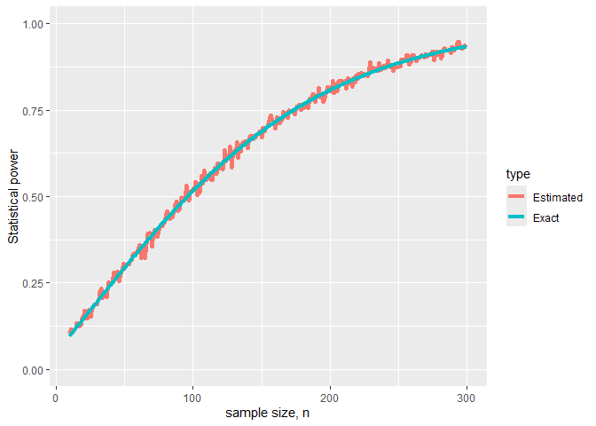

Statistical Power Assessment
================
2024-10-01

## 

Assume that it is known from previous experiments that $\mu = 3$ and
$\sigma = 15$. Use both, analytic and simulation-based power analysis
explained in the previous two sections to evaluate the minimum sample
size $n$ to achieve statistical power of at least 80% at 5% statistical
significance level.

``` r
library(tidyverse)
# actual function at 5% significant level
pow <- function(n.val,mu,sigma){
  1-pnorm(1.96-mu/(sigma/sqrt(n.val)))+pnorm(-1.96-mu/(sigma/sqrt(n.val)))
}

# simulations
pow.est <- function(n.val,mu,sigma,alpha){
  result = 0
  for(j in 1:length(n.val)){
    # 1000 samples of size n.val[j]
    x <- array(rnorm(n.val[j]*1000,mu,sigma),dim=c(n.val[j],1000))
    # means
    x.bar <- apply(x,2,mean)
    
    # performing the test
    p.val <- (1-pnorm(abs(x.bar)/(sigma/sqrt(n.val[j]))))*2
    is.rejected <- (p.val < alpha)
    
    # evaluating the power
    result[j] <- mean(is.rejected)
  }
  return(result)
}
```

Find the minimum sample size $n$ which gives specific statistical power
at 5% significant level.

``` r
n <- seq(10,300,5)
n.mu = 3
n.sigma = 15

n[which(pow(n,n.mu,n.sigma)>.8)[1]]
```

    ## [1] 200

Plot the simulated vs actual graph of sample size and statistical power
at 5% significant level

``` r
n <- seq(10,300,1)
dp <- data.frame(n = rep(n,2),
                 power = c(pow(n,n.mu,n.sigma),
                           pow.est(n,n.mu,n.sigma,0.05)),
                 type = rep(c("Exact","Estimated"),each = length(n)))

dp %>%
  ggplot(aes(x=n,y=power,group = type))+
  geom_line(aes(col = type), linewidth = 1.5)+
  xlab("sample size, n")+
  ylab("Statistical power")+
  ylim(c(0,1))
```

<!-- -->
