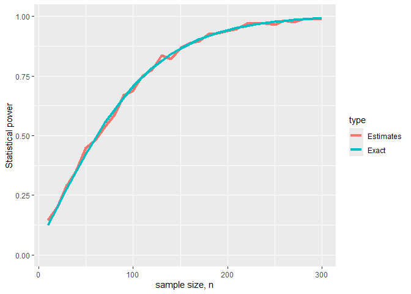

Statistical Power
================
2024-10-01

## Statistical significance level $\alpha$ to the critical value $x^*$

## Statistical power

## Sample size to statistical power

``` r
library(tidyverse)
pow <- function(n.val,mu,sigma){
  1-pnorm(1.96-mu/(sigma/sqrt(n.val)))+pnorm(-1.96-mu/(sigma/sqrt(n.val)))
}

n.val1 <- seq(10,300,10) # possible values for n
mu1 <- 2.5; sigma1=10

plot(n.val1,pow(n.val1,mu1,sigma1),pch=16,col='darkgreen',
     ty='l', lwd=2,
     xlab =' sample size', ylab='Power',ylim=c(0,1),
     main = "mu = 2.5, sigma = 10")

abline(h=.8)
```

<!-- -->

``` r
n.val1[which(pow(n.val1,mu1,sigma1)>.8)[1]]
```

    ## [1] 130

## Simulation

``` r
pow.est <- function(n.val,mu,sigma,alpha){
  result = 0
for(j in 1:length(n.val)){
  # 1000 samples of size n.val[j]
  x <- array(rnorm(n.val[j]*1000,mu,sigma),dim=c(n.val[j],1000))
  # means
  x.bar <- apply(x,2,mean)
  
  # performing the test
  p.val <- (1-pnorm(abs(x.bar)/(sigma/sqrt(n.val[j]))))*2
  is.rejected <- (p.val < alpha)
  
  # evaluating the power
  result[j] <- mean(is.rejected)
}
  return(result)
}

dp <- data.frame(n=rep(n.val1,2),
                 power = c(pow(n.val1,mu1,sigma1),
                           pow.est(n.val1,mu1,sigma1,0.05)),
                 type = rep(c("Exact","Estimates"),each = length(n.val1)))

dp %>%
  ggplot(aes(x=n, y= power, group = type))+
  geom_line(aes(col = type),linewidth = 1.5)+
  xlab("sample size, n")+
  ylab("Statistical power")+
  ylim(c(0,1))
```

<!-- -->
