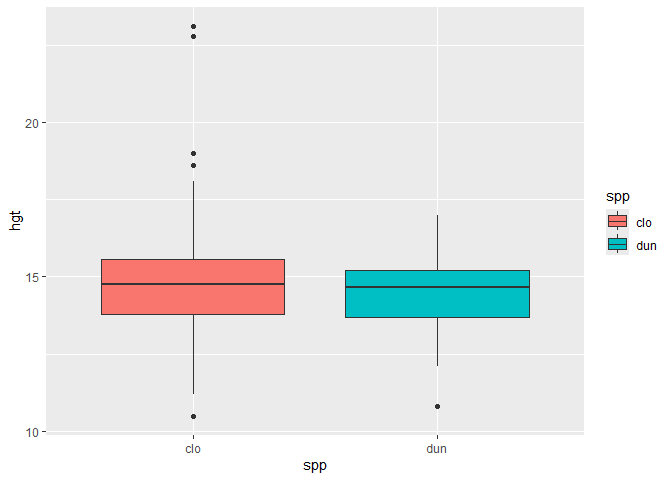
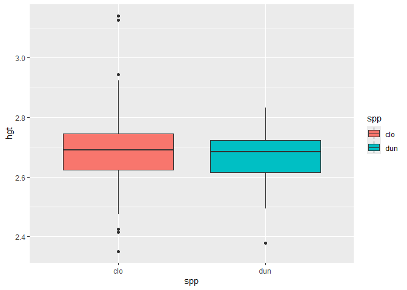
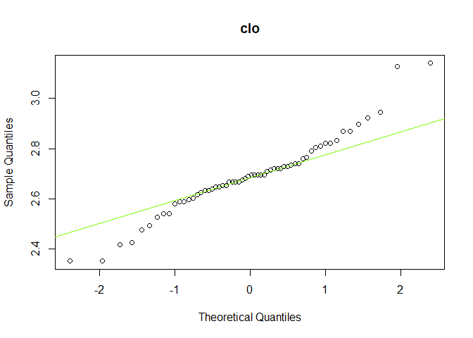
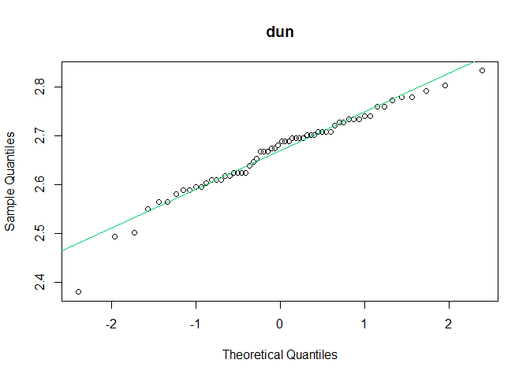

t-test
================
Amnist.O
2024-09-09

# Assessment:

The dataset EucalyptusTtest.csv contains information on heights (m) of
trees of two species of Eucalyptus trees: E. cloeziana and E. dunnii.

Use the t-test in R to test the hypothesis that: there is no difference
in average height for the two species.

You may find the following steps useful:

- Evaluate species-specific sample statistics and produce a boxplot.
  What do you see?
- Check the normality of samples. Does it matter in this situation? Why
  or why not?
- Perform the t-test and interpret the results.
- Try logging the response and repeating the above steps.

## Sample statistics and boxplot

``` r
df$spp <- factor(df$spp)
df %>%
  ggplot(aes(x=spp,y=hgt,fill=spp))+
  geom_boxplot()
```

<!-- -->

``` r
df %>%
  reframe(across(hgt,list(n=length,mean=mean,sd=sd)),.by = spp) %>%
            mutate(se = hgt_sd/sqrt(hgt_n),
                   lo95 = hgt_mean-(1.96*se),
                   hi95 = hgt_mean+(1.96*se)) %>%
  column_to_rownames("spp") %>%
  t() %>%
  data.frame()
```

    ##                 clo        dun
    ## hgt_n    60.0000000 60.0000000
    ## hgt_mean 14.9100000 14.4516667
    ## hgt_sd    2.3518979  1.1541365
    ## se        0.3036287  0.1489984
    ## lo95     14.3148877 14.1596298
    ## hi95     15.5051123 14.7437035

## Sample normality

``` r
qqnorm(df$hgt[df$spp=="clo"],main="clo")
qqline(df$hgt[df$spp=="clo"],col="turquoise3")
```

<!-- -->

``` r
qqnorm(df$hgt[df$spp=="dun"],main="dun")
qqline(df$hgt[df$spp=="dun"],col="turquoise3")
```

<!-- -->

## t-test of the sample

``` r
t.test(hgt~spp,data=df)
```

    ## 
    ##  Welch Two Sample t-test
    ## 
    ## data:  hgt by spp
    ## t = 1.3551, df = 85.858, p-value = 0.1789
    ## alternative hypothesis: true difference in means between group clo and group dun is not equal to 0
    ## 95 percent confidence interval:
    ##  -0.2140362  1.1307028
    ## sample estimates:
    ## mean in group clo mean in group dun 
    ##          14.91000          14.45167

t-test shows that p-value = 0.1789261 meaning that the difference in
both sample means is not statistically significant. The 95% CI is
-0.2140362, 1.1307028.

## Log-transformed of the sample

Statistics and boxplot of log transformed data are as followed:

``` r
df %>%
  mutate(hgt = log(hgt)) -> ldf

ldf %>%
  reframe(across(hgt,list(n=length,mean=mean,sd=sd)),.by = spp) %>%
            mutate(se = hgt_sd/sqrt(hgt_n),
                   lo95 = hgt_mean-(1.96*se),
                   hi95 = hgt_mean+(1.96*se)) %>%
  column_to_rownames("spp") %>%
  t() %>%
  data.frame()
```

    ##                  clo         dun
    ## hgt_n    60.00000000 60.00000000
    ## hgt_mean  2.69058581  2.66756223
    ## hgt_sd    0.15084394  0.08208276
    ## se        0.01947387  0.01059684
    ## lo95      2.65241702  2.64679242
    ## hi95      2.72875459  2.68833203

``` r
ldf %>%
  ggplot(aes(x=spp,y=hgt,fill=spp))+
  geom_boxplot()
```

<!-- -->

Normality of the log transformed data are displayed with qqnorm as
followed:

``` r
qqnorm(ldf$hgt[ldf$spp=="clo"],main="clo")
qqline(ldf$hgt[ldf$spp=="clo"],col="lawngreen")
```

<!-- -->

``` r
qqnorm(ldf$hgt[ldf$spp=="dun"],main="dun")
qqline(ldf$hgt[ldf$spp=="dun"],col="springgreen3")
```

<!-- -->

Log transformed does not help that much.

t-test of the log transformed data are as followed:

``` r
t.test(hgt~spp,data=ldf)
```

    ## 
    ##  Welch Two Sample t-test
    ## 
    ## data:  hgt by spp
    ## t = 1.0385, df = 91.124, p-value = 0.3018
    ## alternative hypothesis: true difference in means between group clo and group dun is not equal to 0
    ## 95 percent confidence interval:
    ##  -0.02101430  0.06706145
    ## sample estimates:
    ## mean in group clo mean in group dun 
    ##          2.690586          2.667562

Interpreting log transformed data need some extra calculation since the
value are in log form. We just need to exponent them with natural number
$e$ and their difference are percentage since it is
$e^{log(a)-log(b)} = a/b$
